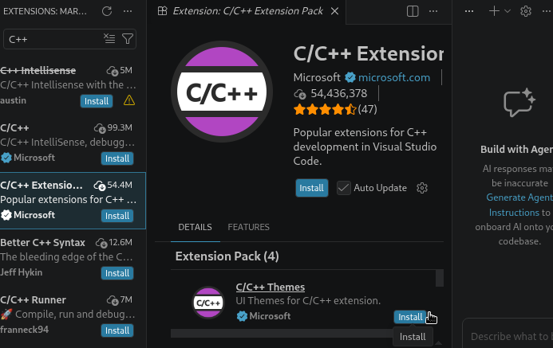
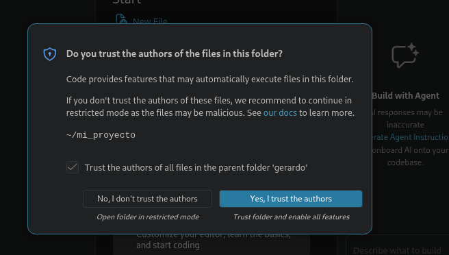
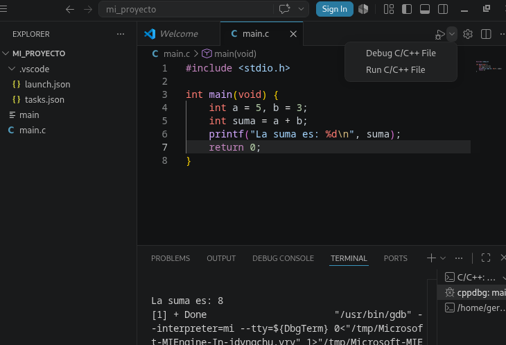

# Compilar y depurar C en Ubuntu con Visual Studio Code

Guía paso a paso para configurar un entorno de desarrollo en C usando GCC, GDB y Visual Studio Code sobre Ubuntu.

---

## 1. Instalar las herramientas de compilación

Abre una terminal e instala el compilador (GCC), el depurador (GDB) y las utilidades de construcción:

```bash
sudo apt update
sudo apt install build-essential gdb
```

Verifica que se instalaron correctamente:

```bash
gcc --version
gdb --version
```

---

## 2. Instalar Visual Studio Code

Tienes dos formas de instalarlo. Usa la que prefieras.

### Opción A: Repositorio oficial de Microsoft (recomendada)

Mantiene VS Code actualizado automáticamente con `apt upgrade`.

```bash
# Instalar dependencias
sudo apt update
sudo apt install wget gpg apt-transport-https

# Importar la clave GPG de Microsoft
wget -qO- https://packages.microsoft.com/keys/microsoft.asc | gpg --dearmor > packages.microsoft.gpg
sudo install -D -o root -g root -m 644 packages.microsoft.gpg /usr/share/keyrings/packages.microsoft.gpg

# Añadir el repositorio
echo "deb [arch=amd64,arm64,armhf signed-by=/usr/share/keyrings/packages.microsoft.gpg] https://packages.microsoft.com/repos/code stable main" | sudo tee /etc/apt/sources.list.d/vscode.list > /dev/null

# Instalar
sudo apt update
sudo apt install code

# Limpiar
rm -f packages.microsoft.gpg
```

### Opción B: Snap (alternativa rápida)

```bash
sudo snap install --classic code
```

> **Nota:** el paquete de Microsoft se llama `code`. No lo confundas con `codium` (VSCodium) ni con paquetes no oficiales de los repositorios de Ubuntu, que suelen estar desactualizados.

---

## 3. Instalar la extensión C/C++

Abre VS Code, ve a **Extensiones** (`Ctrl+Shift+X`), busca `C++` e instala el **C/C++ Extension Pack** de Microsoft.



Este pack incluye IntelliSense (autocompletado), soporte de depuración y temas para C/C++.

---

## 4. Crear el proyecto

Crea una carpeta para tu proyecto y ábrela en VS Code:

```bash
mkdir mi_proyecto && cd mi_proyecto
code .
```

La primera vez que abras la carpeta, VS Code te preguntará si confías en los autores de los archivos. Como es tu propio proyecto, pulsa **"Yes, I trust the authors"**.



Dentro de la carpeta, crea un archivo llamado `main.c` con este contenido de ejemplo:

```c
#include <stdio.h>

int main(void) {
    int a = 5, b = 3;
    int suma = a + b;
    printf("La suma es: %d\n", suma);
    return 0;
}
```

---

## 5. Configurar la compilación y la depuración

Crea una carpeta `.vscode/` dentro del proyecto con los dos archivos siguientes.

### `.vscode/tasks.json` — compila con GCC

```json
{
  "version": "2.0.0",
  "tasks": [
    {
      "label": "Compilar C",
      "type": "shell",
      "command": "/usr/bin/gcc",
      "args": [
        "-g",
        "${file}",
        "-o",
        "${fileDirname}/${fileBasenameNoExtension}"
      ],
      "group": {
        "kind": "build",
        "isDefault": true
      },
      "problemMatcher": ["$gcc"]
    }
  ]
}
```

El flag `-g` es **clave**: incluye los símbolos de depuración. Sin él, GDB no funcionará correctamente.

### `.vscode/launch.json` — depura con GDB

```json
{
  "version": "0.2.0",
  "configurations": [
    {
      "name": "Depurar C",
      "type": "cppdbg",
      "request": "launch",
      "program": "${fileDirname}/${fileBasenameNoExtension}",
      "args": [],
      "stopAtEntry": false,
      "cwd": "${fileDirname}",
      "environment": [],
      "externalConsole": false,
      "MIMode": "gdb",
      "miDebuggerPath": "/usr/bin/gdb",
      "preLaunchTask": "Compilar C",
      "setupCommands": [
        {
          "description": "Habilitar formato legible en gdb",
          "text": "-enable-pretty-printing",
          "ignoreFailures": true
        }
      ]
    }
  ]
}
```

`preLaunchTask` hace que VS Code recompile automáticamente antes de cada sesión de depuración.

---

## 6. Compilar y ejecutar

Tienes varias formas de compilar:

- **Menú:** `Terminal → Run Build Task` (`Ctrl+Shift+B`).
- **Botón de ejecución:** usa el desplegable de la esquina superior derecha y elige **Run C/C++ File**.
- **Manualmente** desde la terminal integrada (`` Ctrl+` ``):

  ```bash
  gcc -g main.c -o main
  ./main
  ```

En la terminal integrada verás el resultado de la ejecución:



---

## 7. Depurar paso a paso

1. Abre `main.c`.
2. Haz clic a la izquierda de un número de línea para colocar un **breakpoint** (punto rojo).
3. Pulsa **F5** para iniciar la depuración.

Controles durante la depuración:

| Tecla         | Acción                          |
|---------------|---------------------------------|
| `F5`          | Continuar                       |
| `F10`         | Step Over (siguiente línea)     |
| `F11`         | Step Into (entrar en función)   |
| `Shift+F11`   | Step Out (salir de función)     |
| `Shift+F5`    | Detener                         |

En el panel izquierdo verás:

- **Variables:** valores en vivo de tus variables.
- **Watch:** expresiones que tú definas para observar.
- **Call Stack:** la pila de llamadas a funciones.

---

## Notas útiles

- Para compilar **varios archivos**, cambia en `tasks.json` el valor `${file}` por `"${fileDirname}/*.c"`.
- Si usas la librería matemática (`math.h`), añade `"-lm"` a los `args`.
- Los errores y advertencias del compilador aparecen subrayados en el editor gracias al `problemMatcher`.
